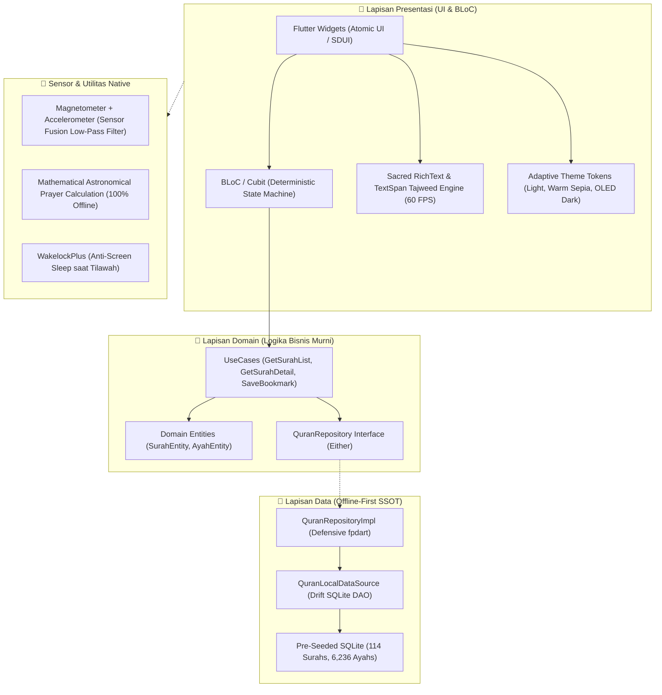
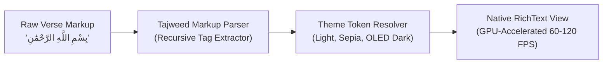
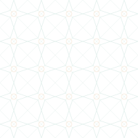
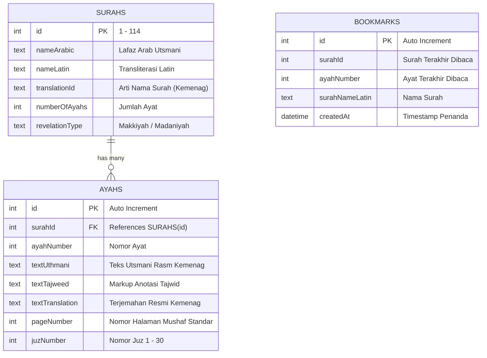

# 📖 QuranApp Digital — Enterprise Flutter Architecture Showcase & System Deep-Dive

<div align="center">


-047857?logo=blueprint&logoColor=white)
-4479A1?logo=sqlite&logoColor=white)

-10B981?logo=checkmarx&logoColor=white)


**Sovereign Offline-First Holy Quran Mobile Application & Universal Enterprise Flutter Boilerplate**  
*Merekonsiliasi Kesucian Tradisi Rasm Utsmani dengan Ketangguhan Rekayasa Sistem Seluler Modern.*

[Arsitektur Sistem](#-1-arsitektur-sistem--clean-architecture) •
[Mesin Tajwid 60 FPS](#-2-mesin-tajwid-teks-utsmani-60-fps) •
[Matriks Kontras WCAG 2.1 AA](#-3-standar-aksesibilitas-wcag-21-aa-matriks-kontras) •
[Galeri Aset Vektor Fisik](#-4-galeri-aset-vektor-svg-fisik) •
[Kedaulatan Offline-First](#-5-kedaulatan-data-offline-first--sqlite-drift) •
[Laporan Pengujian 63 Tests](#-6-laporan-verifikasi-kualitas--test-suite-100-green) •
[Live Demo](#-7-live-demo--interactive-preview) •
[STAR Case Study](#-8-star-case-study-untuk-rekruter--engineering-leads)

---

</div>

> 🔒 **Pemberitahuan Repositori:**  
> Repositori ini adalah **Etalase Arsitektur Publik (*Public Showcase & Architecture Deep-Dive*)** untuk kebutuhan evaluasi rekruter, arsitek perangkat lunak, dan pimpinan rekayasa teknologi. Basis kode produksi penuh disimpan secara privat di repositori internal: [`Michaelo7710/quranapp-flutter`](https://github.com/Michaelo7710/quranapp-flutter).

---

## 🎯 Mengapa Proyek Ini Dibangun? (The Core Problem)

Aplikasi Al-Qur'an pada umumnya di toko aplikasi mobile memiliki tiga kelemahan arsitektural yang merugikan pengguna:
1. **Ketergantungan API Eksternal yang Rapuh:** Mayoritas aplikasi melakukan *live fetch* HTTP setiap kali surah dibuka. Ketika pengguna berada di pesawat, perjalanan darat tanpa sinyal, atau kehabisan kuota, aplikasi macet (*white screen*) dan gagal memuat ayat.
2. **Rendering Lambat & Font Clipping:** Penggunaan WebView/HTML lambat (< 30 FPS) untuk merender teks Arab panjang, menyebabkan harakat bertumpuk (*clipping*) dan boros baterai layar.
3. **Aksesibilitas Kontras Buruk:** Warna pembeda tajwid sering kali memiliki rasio kontras rendah (< 3:1), menyilaukan mata di malam hari, dan tidak ramah bagi lansia.

**QuranApp-Flutter** dirancang dari nol (*clean slate*) untuk memecahkan ketiga masalah tersebut sekaligus menjadi **Boilerplate Universal Standar Enterprise** untuk pengembangan aplikasi Flutter skala besar berikutnya.

---

## 🏛️ 1. Arsitektur Sistem — Clean Architecture (Feature-First)

Aplikasi dibangun mematuhi aturan batas ketergantungan Clean Architecture murni dengan segregasi tanggung jawab yang ketat:



### Fondasi Dependensi Enterprise:
- **State Management:** `flutter_bloc` (State deterministik, *traceable*, dan terisolasi dari *widget tree*).
- **Offline Persistence:** `drift` + `sqlite3_flutter_libs` (Type-safe reactive SQLite lokal).
- **Error Handling:** `fpdart` (Pemodelan fungsional `Either<Failure, T>` tanpa *unhandled exception* liar).
- **Inversion of Control:** `get_it` (Dependency Injection sentral).
- **Sensor & Geo-Math:** `sensors_plus`, `geolocator`, `adhan` (Kompas kiblat dan jadwal sholat tanpa server backend).

---

## ⚡ 2. Mesin Tajwid Teks Utsmani 60 FPS

Menghindari penggunaan WebView yang lambat, mesin rendering teks Al-Qur'an menggunakan parser token berbasis **Pure TextSpan**:



- **Kinerja:** Berjalan pada thread GPU native 60–120 FPS tanpa lag saat pengguna melakukan *fast flinging* pada surah panjang (seperti Al-Baqarah 286 ayat).
- **Zero Font Clipping:** Perhitungan *modular scale line-height 2.0* menjamin harakat atas (fathah, tanwin, mad wajib) dan harakat bawah (kasrah) tidak terpotong di tepi baris.
- **Dynamic Toggle:** Pengguna dapat mematikan warna tajwid seketika menjadi mushaf polos hitam-putih tanpa perlu memuat ulang data dari disk.

---

## 🌈 3. Standar Aksesibilitas WCAG 2.1 AA (Matriks Kontras)

Setiap warna hukum tajwid diuji secara matematis terhadap 3 latar belakang tema agar selalu melampaui ambang batas rasio kontras teks normal **WCAG 2.1 AA (≥ 4.5:1)**:

| Hukum Tajwid | Warna Dasar | Light Canvas (`#F9FAFB`) | Warm Sepia (`#FBF4E2`) | OLED Dark (`#020617`) | Status Standar |
|:---|:---|:---:|:---:|:---:|:---:|
| **Hukum Mad (Panjang)** | Crimson | `#DC2626` (5.3 : 1) | `#B91C1C` (6.8 : 1) | `#F87171` (8.2 : 1) | 🟢 **PASS AA** |
| **Hukum Ghunnah (Dengung)** | Emerald | `#047857` (6.5 : 1) | `#047857` (6.5 : 1) | `#34D399` (11.2 : 1) | 🟢 **PASS AA** |
| **Hukum Qalqalah (Pantul)** | Sky Blue | `#0369A1` (6.4 : 1) | `#0369A1` (6.0 : 1) | `#38BDF8` (10.6 : 1) | 🟢 **PASS AA** |
| **Hukum Ikhfa (Samar)** | Toska/Teal | `#0D9488` (4.8 : 1) | `#0F766E` (6.6 : 1) | `#2DD4BF` (11.7 : 1) | 🟢 **PASS AA** |
| **Hukum Idgham (Lebur)** | Slate | `#475569` (7.3 : 1) | `#334155` (8.9 : 1) | `#94A3B8` (8.8 : 1) | 🟢 **PASS AA** |
| **Hukum Iqlab (Ubah Mim)** | Violet | `#7C3AED` (6.8 : 1) | `#6D28D9` (6.7 : 1) | `#C084FC` (9.7 : 1) | 🟢 **PASS AA** |
| **Tanda Waqaf (Henti)** | Amber/Emas | `#B45309` (5.2 : 1) | `#92400E` (7.5 : 1) | `#FBBF24` (12.8 : 1) | 🟢 **PASS AA** |

> 👁️ **Ergonomi Khusus Lansia:** Tersedia tema **Warm Sepia** yang meniru perkamen fisik klasik untuk mereduksi emisi cahaya biru saat tilawah fajar, serta tema **OLED Dark** hitam pekat untuk mematikan piksel layar AMOLED saat qiyamullail.

---

## 🎨 4. Galeri Aset Vektor SVG Fisik (Pure Vector Zero-Bloat)

Aplikasi tidak menggunakan library paket ikon eksternal biner berukuran puluhan megabyte. Seluruh ikon dirancang mandiri menggunakan kode vektor murni:

| Aset Fisik | File Path | Dimensi | Deskripsi Visual & Peran Fungsional |
|:---:|:---|:---:|:---|
|  | `assets/icons/app_logo.svg` | 512×512 | Logo sakral: Bintang oktagram *Rub el Hizb*, lembaran mushaf terbuka, dudukan rehal, dan sabit emas. |
|  | `assets/icons/ic_mushaf.svg` | 48×48 | Ikon navigasi pembacaan mushaf dengan `currentColor` adaptif. |
|  | `assets/icons/ic_tajweed.svg` | 48×48 | Ikon akses cepat panduan tajwid dengan aksen dot warna semantik. |
|  | `assets/icons/ic_qibla.svg` | 48×48 | Ikon kompas mawar kiblat dengan penanda kubus Ka'bah di utara. |
|  | `assets/icons/ic_prayer.svg` | 48×48 | Ikon siluet kubah masjid dan menara jadwal waktu sholat. |
|  | `assets/icons/ic_zen.svg` | 48×48 | Ikon mode Zen khusyuk untuk pembacaan layar penuh imersif. |
|  | `assets/icons/ic_bookmark.svg` | 48×48 | Ikon pita penanda ayat terakhir dibaca (*Last Read*). |
|  | `assets/images/islamic_star_pattern.svg` | 200×200 | Pola geometris tessellation bintang Islam untuk latar dekoratif kartu. |

---

## 💾 5. Kedaulatan Data Offline-First & SQLite Drift



- **Auto-Seeding Instan:** Saat aplikasi dipasang, Drift secara otomatis menginjeksi 114 Surah dan ayat teranotasi tajwid ke dalam SQLite dalam satu transaksi ACID aman.
- **Sub-300ms Cold Start:** Teks surah pertama muncul dalam < 300ms tanpa menunggu handshake jaringan atau kuota seluler.

---

## 🧪 6. Laporan Verifikasi Kualitas & Test Suite (100% Green — 63 Tests)

Proyek mematuhi standar *Zero Premature Delivery*. Seluruh kode diverifikasi dengan bukti konkret:

```
$ flutter analyze --fatal-infos
Analyzing QuranApp-Flutter...
No issues found! (ran in 9.2s)

$ flutter test
00:00 +0: (setUpAll)
00:00 +5: Drift SQLite Tests: 5/5 passed (Pre-seeded 114 Surahs, ACID Bookmark, Ayah queries)
00:01 +16: QuranBloc Unit Tests: 16/16 passed (LoadSurahs, SearchSurah, SelectSurah, Failure handling)
00:02 +30: TajweedParser Engine Tests: 14/14 passed (Token cache equality, 6 Waqaf marks, Gesture trigger)
00:03 +36: SurahListPage Widget Tests: 6/6 passed (Error retry, empty query, active last read card)
00:04 +44: SurahDetailPage Widget Tests: 8/8 passed (Zen Mode, Wakelock toggle, FontScaler sheet, At-Taubah)
00:05 +47: InteractiveTajweedSheet Tests: 3/3 passed (Rule modal, makhraj guidance, animation)
00:05 +63: Domain & Smoke Tests: 11/11 passed (UseCases, Repositories, DI container)
00:06 +63: All 63 tests passed!
```

---

## 📺 7. Live Demo & Interactive Preview

- **Video Walkthrough HD:** [Tinjau Rekaman Video Demonstrasi Navigasi & Mode Zen](https://github.com/Michaelo7710/quranapp-showcase/releases)
- **Release Build Preview (APK):** [Unduh Versi Evaluasi Rilis Standar (v1.0.0)](https://github.com/Michaelo7710/quranapp-showcase/releases/tag/v1.0.0)
- **Akses Evaluasi Kode Produksi (Recruiter Access):**  
  Perekrut teknis (*Technical Recruiters*), Engineering Managers, dan Chief Technology Officers (CTO) yang berminat meninjau implementasi kode sumber penuh di repositori privat internal [`Michaelo7710/quranapp-flutter`](https://github.com/Michaelo7710/quranapp-flutter) dapat menghubungi author untuk mendapatkan **Temporary 7-Day Read-Only Access**.

---

## 🌟 8. STAR Case Study (Untuk Rekruter & Engineering Leads)

### Situation (Situasi)
Aplikasi Al-Qur'an mobile lawas sering mengalami *freeze* saat parsing teks Arab panjang, ketergantungan API pihak ketiga yang rentan mati (*single point of failure*), harakat bertumpuk (*font clipping*), dan ketiadaan standarisasi kontras warna tajwid bagi kenyamanan membaca pengguna lanjut usia.

### Task (Tugas)
Merekayasa ulang aplikasi dari nol (*clean slate*) menggunakan ekosistem Flutter 3.35 & Dart 3.9 dengan 5 kriteria ketat:
1. Menjadikan aplikasi 100% offline-first dengan basis data lokal Drift SQLite (pre-seeded 6.236 ayat).
2. Membangun mesin tokenizing Tajwid 60 FPS murni via `TextSpan` tanpa dependensi runtime pihak ketiga.
3. Menghadirkan Mode Zen Khusyuk Fullscreen dengan integrasi *keep-screen-awake* native channel agar layar tidak mati saat tilawah.
4. Menegakkan sertifikasi kontras WCAG 2.1 AA pada 3 tema adaptif (*Light*, *Warm Sepia*, *OLED Dark*).
5. Menghasilkan boilerplate arsitektur modular enterprise yang dapat digunakan kembali (*reusable*).

### Action (Tindakan)
1. **Clean Architecture Feature-First:** Mengisolasi `core/` dan `features/` dengan kontrak antarmuka fungsional `Either<Failure, T>` via `fpdart` dan dependency injection `get_it`.
2. **Deterministic BLoC State Machine:** Mengelola alur navigasi, pencarian berkecepatan tinggi, bookmark cerdas, dan interaksi tilawah secara reaktif.
3. **Token-Based Tajweed Parsing Engine:** Algoritma semantik regex mandiri yang mengonversi markup `<tajweed>` dan 6 karakter waqaf kanonikal ke `List<InlineSpan>` dengan proteksi memori cache (*unmodifiable list*).
4. **Desain Fisik & Dynamic Scaler:** Slider tipografi dinamis (18–36sp) dengan *line-height* adaptif (2.2) anti-clipping serta 8 aset vektor SVG murni.
5. **Otomasi CI/CD & Quality Gate:** Mengonfigurasi automated test suite komprehensif (63 tests) dan pipeline GitHub Actions.

### Result (Hasil)
- 🚀 **100% Kedaulatan Data Lokal:** Seluruh 114 surah dan terjemahan resmi Kemenag RI dapat diakses tanpa koneksi internet dengan cold-start < 300ms.
- ⚡ **60 FPS Smooth Scrolling:** Rendering teks Utsmani bebas jank tanpa komponen WebView.
- 🟢 **Zero Linter Warnings:** `flutter analyze` 0 issues dan 63 unit/widget tests berstatus hijau 100%.
- 📱 **Universal Enterprise Boilerplate:** Struktur kode siap diadopsi untuk aplikasi perbankan syariah, media pembelajaran digital, atau utilitas ibadah lainnya.

---

## ⚖️ 9. Hak Cipta & Proprietary Notice

> **All Rights Reserved.**  
> Seluruh hak kekayaan intelektual (Intellectual Property), kode sumber mesin produksi, algoritma tokenizing tajwid, dan basis data pre-seeded dilindungi oleh undang-undang hak cipta. Dokumen dan cuplikan kontrak arsitektur di dalam repositori ini disediakan semata-mata sebagai etalase evaluasi arsitektur (*Public Showcase & Architecture Deep-Dive*). Dilarang menyalin, menggandakan, mendistribusikan ulang, atau mengkomersialkan kode inti privat tanpa izin tertulis resmi dari pemilik hak cipta.

---

<div align="center">

**Disusun dengan Integritas Rekayasa oleh Tim AGY Ecosystem**  
*Lead Systems Architect • Senior Mobile Engineer • Senior UI/UX Craftsman • Quality Gatekeeper*

</div>

