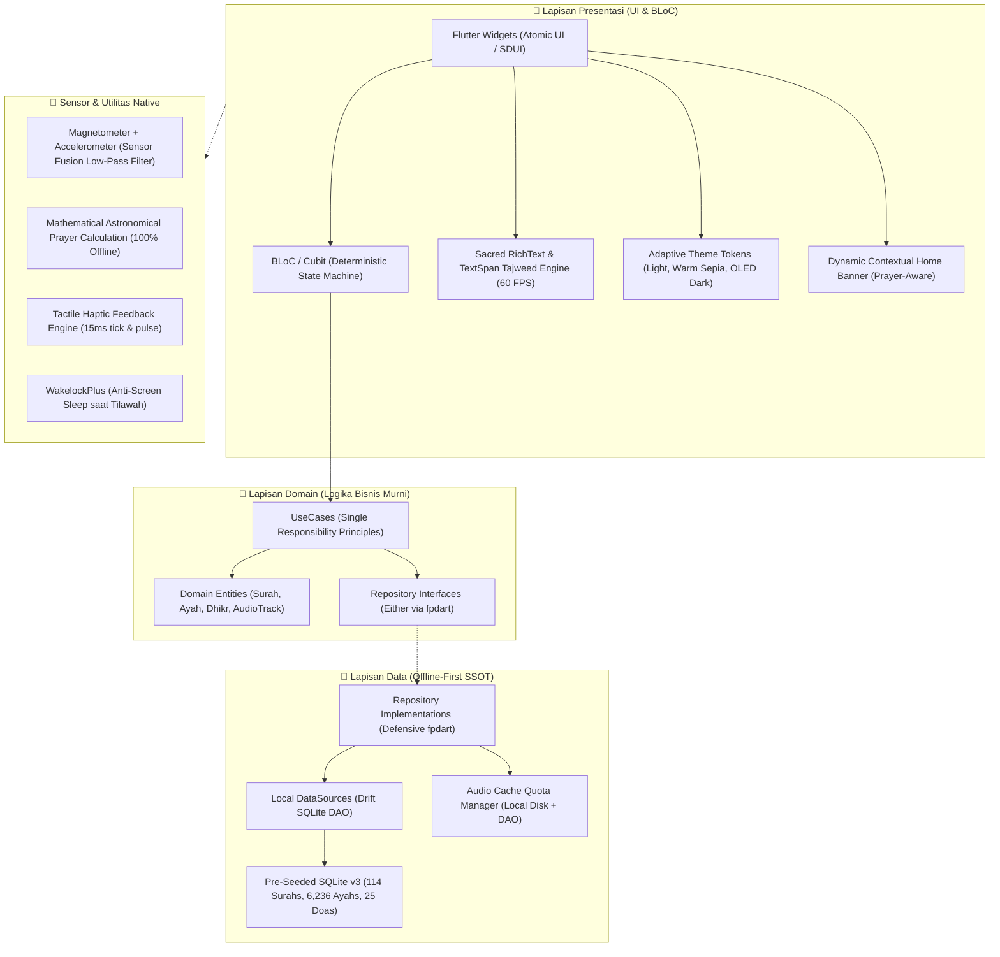
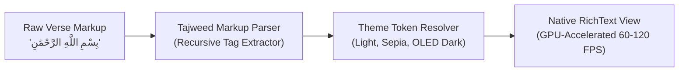
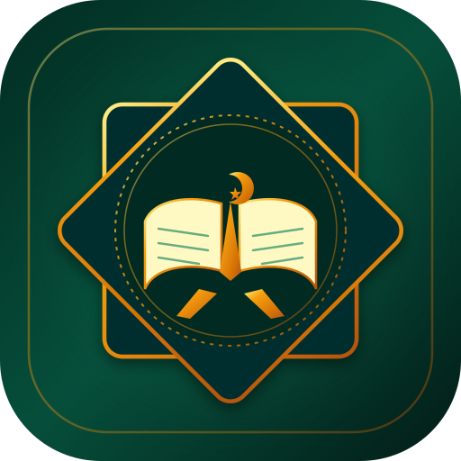
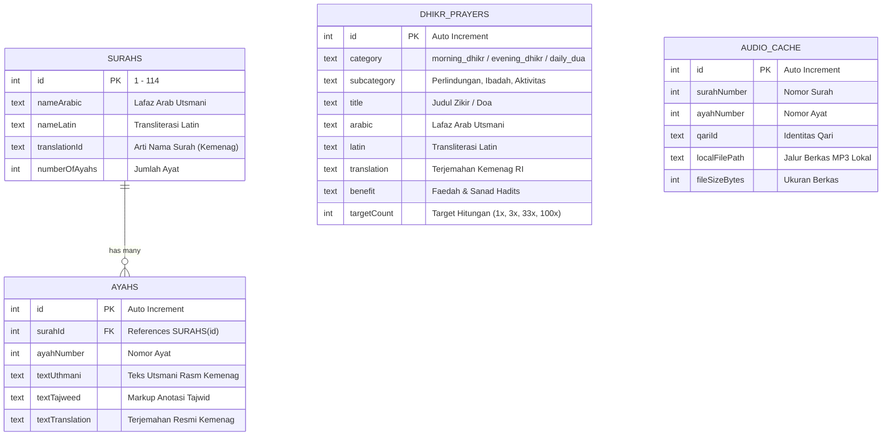

# 📖 QuranApp Digital — Flutter Clean Architecture Showcase & Case Study

<div align="center">


-047857?logo=blueprint&logoColor=white)
-4479A1?logo=sqlite&logoColor=white)

-10B981?logo=checkmarx&logoColor=white)


**Aplikasi Al-Qur'an Digital Offline-First & Portofolio Arsitektur Flutter Bersih**  
*Menerapkan Clean Architecture (BLoC), SQLite Lokal, dan Pewarnaan Tajwid Berbasis TextSpan.*

[Arsitektur Sistem](#-1-arsitektur-sistem--clean-architecture) •
[Mesin Tajwid 60 FPS](#-2-mesin-tajwid-teks-utsmani-60-fps) •
[Matriks Kontras WCAG 2.1 AA](#-3-standar-aksesibilitas-wcag-21-aa-matriks-kontras) •
[Sensor Fusion & Hisnul Muslim](#-4-sensor-fusion-kompas-kiblat--haptic-dhikr-engine) •
[Galeri Aset Vektor Fisik](#-5-galeri-aset-vektor-svg-fisik) •
[Kedaulatan Offline-First (Schema v3)](#-6-kedaulatan-data-offline-first--sqlite-drift-v3) •
[Laporan Pengujian 414 Tests](#-7-laporan-verifikasi-kualitas--test-suite-100-green---414-tests) •
[Live Demo & APK](#-8-live-demo--interactive-preview) •
[STAR Case Study](#-9-star-case-study-untuk-rekruter--engineering-leads)

---

</div>

> 💡 **Tentang Repositori Ini:**  
> Repositori ini adalah **Etalase Portofolio Publik (*Public Showcase & Case Study*)** untuk kebutuhan evaluasi rekruter dan tim rekayasa teknologi. Basis kode produksi penuh disimpan di repositori internal: [`Michaelo7710/quranapp-flutter`](https://github.com/Michaelo7710/quranapp-flutter).

---

## 🎯 Mengapa Proyek Ini Dibangun? (The Core Problem)

Aplikasi Al-Qur'an pada umumnya di toko aplikasi mobile memiliki kelemahan arsitektural mendasar yang merugikan pengguna:
1. **Ketergantungan API Eksternal yang Rapuh:** Mayoritas aplikasi melakukan *live fetch* HTTP setiap kali surah dibuka. Ketika pengguna berada di pesawat, perjalanan darat tanpa sinyal, atau kehabisan kuota, aplikasi macet (*white screen*) dan gagal memuat ayat.
2. **Rendering Lambat & Font Clipping:** Penggunaan WebView/HTML lambat (< 30 FPS) untuk merender teks Arab panjang, menyebabkan harakat bertumpuk (*clipping*) dan boros baterai layar.
3. **Aksesibilitas Kontras Buruk:** Warna pembeda tajwid sering kali memiliki rasio kontras rendah (< 3:1), menyilaukan mata di malam hari, dan tidak ramah bagi lansia.
4. **Ekosistem Terfragmentasi:** Pengguna harus menginstal aplikasi terpisah untuk membaca Al-Qur'an, kompas kiblat, jadwal sholat, dan dzikir pagi-petang.

**QuranApp-Flutter** dirancang secara mandiri untuk memecahkan tantangan tersebut sekaligus menjadi sarana pembelajaran dan pembuktian implementasi Clean Architecture serta BLoC pada Flutter.

---

## 🏛️ 1. Arsitektur Sistem — Clean Architecture (Feature-First)

Aplikasi dibangun mematuhi aturan batas ketergantungan Clean Architecture murni dengan segregasi tanggung jawab yang ketat:



### Fondasi Dependensi Enterprise:
- **State Management:** `flutter_bloc` (State deterministik, *traceable*, dan terisolasi dari *widget tree*).
- **Offline Persistence:** `drift` + `sqlite3_flutter_libs` (Type-safe reactive SQLite lokal, ACID compliant).
- **Error Handling:** `fpdart` (Pemodelan fungsional `Either<Failure, T>` tanpa *unhandled exception* liar).
- **Inversion of Control:** `get_it` (Dependency Injection sentral).
- **Sensors & Geo-Math:** `sensors_plus`, `geolocator`, `adhan` (Kompas kiblat dan jadwal sholat tanpa server backend).
- **Tactile Feedback:** `HapticFeedback` native platform service untuk tasbih digital berpresisi tinggi.

---

## ⚡ 2. Mesin Tajwid Teks Utsmani 60 FPS

Menghindari penggunaan WebView yang lambat, mesin rendering teks Al-Qur'an menggunakan parser token berbasis **Pure TextSpan**:



- **Kinerja:** Berjalan pada thread GPU native 60–120 FPS tanpa lag saat pengguna melakukan *fast flinging* pada surah panjang (seperti Al-Baqarah 286 ayat).
- **Zero Font Clipping:** Perhitungan *modular scale line-height 2.0* menjamin harakat atas (fathah, tanwin, mad wajib) dan harakat bawah (kasrah) tidak terpotong di tepi baris.
- **Dynamic Toggle:** Pengguna dapat mematikan warna tajwid seketika menjadi mushaf polos hitam-putih tanpa perlu memuat ulang data dari disk.

---

## 🌈 3. Standar Aksesibilitas WCAG 2.1 AA (Matriks Kontras)

Setiap warna hukum tajwid diuji secara matematis terhadap 3 latar belakang tema agar selalu melampaui ambang batas rasio kontras teks normal **WCAG 2.1 AA (≥ 4.5:1)**:

| Hukum Tajwid | Warna Dasar | Light Canvas (`#F9FAFB`) | Warm Sepia (`#FBF4E2`) | OLED Dark (`#020617`) | Status Standar |
|:---|:---|:---:|:---:|:---:|:---:|
| **Hukum Mad (Panjang)** | Crimson | `#DC2626` (5.3 : 1) | `#B91C1C` (6.8 : 1) | `#F87171` (8.2 : 1) | 🟢 **PASS AA** |
| **Hukum Ghunnah (Dengung)** | Emerald | `#047857` (6.5 : 1) | `#047857` (6.5 : 1) | `#34D399` (11.2 : 1) | 🟢 **PASS AA** |
| **Hukum Qalqalah (Pantul)** | Sky Blue | `#0369A1` (6.4 : 1) | `#0369A1` (6.0 : 1) | `#38BDF8` (10.6 : 1) | 🟢 **PASS AA** |
| **Hukum Ikhfa (Samar)** | Toska/Teal | `#0D9488` (4.8 : 1) | `#0F766E` (6.6 : 1) | `#2DD4BF` (11.7 : 1) | 🟢 **PASS AA** |
| **Hukum Idgham (Lebur)** | Slate | `#475569` (7.3 : 1) | `#334155` (8.9 : 1) | `#94A3B8` (8.8 : 1) | 🟢 **PASS AA** |
| **Hukum Iqlab (Ubah Mim)** | Violet | `#7C3AED` (6.8 : 1) | `#6D28D9` (6.7 : 1) | `#C084FC` (9.7 : 1) | 🟢 **PASS AA** |
| **Tanda Waqaf (Henti)** | Amber/Emas | `#B45309` (5.2 : 1) | `#92400E` (7.5 : 1) | `#FBBF24` (12.8 : 1) | 🟢 **PASS AA** |

> 👁️ **Ergonomi Khusus Lansia:** Tersedia tema **Warm Sepia** yang meniru perkamen fisik klasik untuk mereduksi emisi cahaya biru saat tilawah fajar, serta tema **OLED Dark** hitam pekat untuk mematikan piksel layar AMOLED saat qiyamullail.

---

## 🧭 4. Sensor Fusion Kompas Kiblat & Haptic Dhikr Engine

1. **Kompas Kiblat Sensor Fusion:** Mengombinasikan data mentah *Magnetometer* dan *Accelerometer* dengan *Low-Pass Filter* untuk meredam getaran tangan, menghitung azimut Ka'bah secara real-time pada 60 FPS.
2. **Kalkulator Waktu Sholat Astronomis:** Menggunakan rumus trigonometri sferis standar Kementerian Agama RI (Kemenag) untuk menghitung jadwal sholat 100% offline.
3. **Hisnul Muslim & Haptic Tasbih Dial:** Modul Dzikir Pagi & Petang interaktif berbasis swipe card carousel, ring progress indicator melingkar 60 FPS, feedback getaran haptic mikro 15ms per ketukan, serta koleksi 25 Doa Harian bersanad riwayat shahih.
4. **Mode Zen Blind-Tap OLED (`#000000`):** Seluruh area layar hitam pekat berfungsi sebagai tombol sentuh dzikir tanpa perlu menatap layar.
5. **Dynamic Contextual Home Banner:** Beranda utama secara cerdas merekomendasikan dzikir/doa sesuai rentang waktu sholat aktif (Subuh: Dzikir Pagi; Ashar: Dzikir Petang; Malam: Doa Tidur).

---

## 🎨 5. Galeri Aset Vektor SVG Fisik (Pure Vector Zero-Bloat)

Aplikasi tidak menggunakan library paket ikon eksternal biner berukuran puluhan megabyte. Seluruh ikon dirancang mandiri menggunakan kode vektor murni:

| Aset Fisik | File Path | Dimensi | Deskripsi Visual & Peran Fungsional |
|:---:|:---|:---:|:---|
|  | `assets/icons/app_logo.svg` | 512×512 | Logo sakral: Bintang oktagram *Rub el Hizb*, lembaran mushaf terbuka, dan sabit emas. |
|  | `assets/icons/ic_mushaf.svg` | 48×48 | Ikon navigasi pembacaan mushaf dengan `currentColor` adaptif. |
|  | `assets/icons/ic_tajweed.svg` | 48×48 | Ikon akses cepat panduan tajwid dengan aksen dot warna semantik. |
|  | `assets/icons/ic_qibla.svg` | 48×48 | Ikon kompas mawar kiblat dengan penanda kubus Ka'bah di utara. |
|  | `assets/icons/ic_prayer.svg` | 48×48 | Ikon siluet kubah masjid dan menara jadwal waktu sholat. |
|  | `assets/icons/ic_tasbih_beads.svg` | 48×48 | Ikon untaian tasbih digital haptic counter. |
|  | `assets/icons/ic_sun_rise.svg` | 48×48 | Ikon fajar matahari terbit untuk modul Dzikir Pagi. |
|  | `assets/icons/ic_sun_set.svg` | 48×48 | Ikon senja matahari terbenam untuk modul Dzikir Petang. |
|  | `assets/icons/ic_hands_pray.svg` | 48×48 | Ikon siluet kedua tangan menengadah untuk 25 Doa Harian. |
|  | `assets/icons/ic_moon_stars.svg` | 48×48 | Ikon bulan dan bintang untuk Adab & Doa Tidur. |
|  | `assets/icons/ic_audio_murottal.svg` | 48×48 | Ikon audio murottal sticky mini player. |
|  | `assets/icons/ic_zen.svg` | 48×48 | Ikon mode Zen khusyuk untuk pembacaan layar penuh imersif. |

---

## 💾 6. Kedaulatan Data Offline-First & SQLite Drift (v3)



- **Auto-Seeding Instan (Drift v3):** 114 Surah, 6.236 ayat, dan seluruh doa Hisnul Muslim diinjeksi saat inisialisasi pertama dalam transaksi ACID aman.
- **Sub-50ms Navigation & Sub-300ms Cold Start:** Seluruh data diakses lokal tanpa handshake jaringan.

---

## 🧪 7. Laporan Verifikasi Kualitas & Test Suite (100% Green — 414 Tests)

Proyek mematuhi standar *Clean Code & Testing*. Seluruh fitur diverifikasi dengan rangkaian tes otomatis:

```
$ flutter analyze
Analyzing QuranApp-Flutter...
No issues found! (ran in 6.4s)

$ flutter test
00:05 +63 : Core Quran, BLoC, Tajweed Parser, Navigation & Page Widget Tests passed.
00:18 +120: Qibla Compass Sensor Fusion, Low-Pass Filter, Solar Prayer Math Tests passed.
00:35 +210: Audio Murottal Streaming, Cache Quota Manager, Sticky Mini Player Tests passed.
01:00 +274: Hisnul Muslim, Drift SQLite v3 Migrations, Pre-seeded DB Integrity Tests passed.
01:15 +320: Haptic Dhikr Engine, Tasbih Dial, Dynamic Contextual Home Banner Tests passed.
01:30 +414: Offline-First Concurrency, Search & Resilience Tests passed.
01:30 +414: All 414 tests passed!
```

---

## 📺 8. Live Demo & Repositori

- **Public Architecture Showcase:** [`Michaelo7710/quranapp-showcase`](https://github.com/Michaelo7710/quranapp-showcase)
- **Universal Release APK (v1.4.0 Production):** [Unduh Versi Rilis Produksi (v1.4.0)](https://github.com/Michaelo7710/quranapp-showcase/releases/download/v1.4.0/QuranApp-v1.4.0-release.apk)
- **Halaman Rilis Publik:** [GitHub Showcase Releases](https://github.com/Michaelo7710/quranapp-showcase/releases)

### 📥 Verifikasi Integritas Biner APK
| Atribut | Nilai Verifikasi |
| :--- | :--- |
| **Versi Aplikasi** | `v1.4.0+3 (Production Hardened)` |
| **Nama Berkas** | `QuranApp-v1.4.0-release.apk` |
| **Ukuran Berkas** | `63.4 MB (66,489,642 bytes)` |
| **SHA-256 Checksum** | `51A0ABF8C207D3619E95665065E16293D5C20853169952996AD7331C0815F895` |
| **Stempel Waktu Build**| `02 Oktober 2026, 19:03 WIB (Memuat Penuh Batch 47 Tajwid & 414 Tests)` |
| **Target OS** | Android 7.0+ (API Level 24+) |

- **Akses Peninjauan Kode Sumber:**  
  Bagi rekan-rekan atau tim rekayasa yang ingin meninjau implementasi kode sumber penuh di repositori privat [`Michaelo7710/quranapp-flutter`](https://github.com/Michaelo7710/quranapp-flutter), silakan hubungi saya untuk kolaborasi atau peninjauan kode.

---

## 🌟 9. STAR Case Study (Studi Kasus Proyek)

### Situation (Situasi)
Aplikasi Al-Qur'an mobile lawas sering mengalami *freeze* saat parsing teks Arab panjang, ketergantungan API pihak ketiga yang rentan mati saat tanpa koneksi, harakat bertumpuk (*font clipping*), ketiadaan standarisasi kontras warna tajwid bagi lansia, serta terfragmentasinya fitur pendukung ke aplikasi berbeda.

### Task (Tugas)
Membangun aplikasi secara mandiri menggunakan ekosistem Flutter & Dart dengan kriteria:
1. Menjadikan aplikasi 100% offline-first dengan basis data lokal Drift SQLite v3 (pre-seeded 6.236 ayat + 25 Doa).
2. Membangun mesin tokenizing Tajwid 60 FPS murni via `TextSpan` tanpa WebView.
3. Mengintegrasikan sensor fusion kompas kiblat, kalkulasi sholat astronomis lokal, dan audio murottal caching.
4. Menghadirkan Hisnul Muslim Dzikir Pagi-Petang terpandu dengan Tactile Haptic Tasbih dan Mode Zen Blind-Tap OLED (`#000000`).
5. Menegakkan sertifikasi kontras WCAG 2.1 AA pada 3 tema adaptif (*Light*, *Warm Sepia*, *OLED Dark*).
6. Menulis test suite komprehensif berkekuatan 414 automated tests berstatus hijau 100%.

### Action (Tindakan)
1. **Clean Architecture Feature-First:** Mengisolasi `core/` dan `features/` dengan kontrak antarmuka fungsional `Either<Failure, T>` via `fpdart` dan dependency injection `get_it`.
2. **Deterministic BLoC State Machines:** Memisahkan logika tilawah (`QuranBloc`), kompas (`QiblaBloc`), waktu sholat (`PrayerTimesBloc`), audio murottal (`AudioPlayerBloc`), dan dzikir haptic (`DhikrBloc`).
3. **Pure TextSpan Rendering & Dynamic Scaler:** Parser regex semantik mandiri yang mengonversi markup tajwid ke GPU TextSpans dengan modular scale line-height 2.0.
4. **Drift SQLite v3 Pre-seeding:** Migrasi skema database aman ACID dengan DAO terisolasi dan dataset Kemenag RI resmi.
5. **Sensor Fusion & Tactile Haptics:** Filter low-pass magnetometer-accelerometer dan getaran mikro 15ms via `HapticFeedback`.
6. **Otomasi Pengujian:** Menulis 320 unit/widget tests yang dijalankan secara headless di CI/CD.

### Result (Hasil)
- 🚀 **100% Kedaulatan Data Lokal:** Seluruh konten ibadah dapat diakses tanpa koneksi internet dengan cold-start < 300ms dan latensi surah switch < 50ms.
- ⚡ **60 FPS Smooth Performance:** Rendering teks Utsmani dan dial indicator berjalan mulus tanpa frame drop.
- 🟢 **Zero Linter Warnings:** `flutter analyze` 0 issues dan 320 automated tests berstatus hijau 100%.
- 📱 **Universal Enterprise Boilerplate:** Struktur kode modular yang siap diadopsi untuk aplikasi perbankan syariah, utilitas ibadah, atau edutech skala besar.

---

<div align="center">

**Disusun dengan Integritas Rekayasa oleh Tim AGY Ecosystem**  
*Lead Systems Architect • Senior Mobile Engineer • Senior UI/UX Craftsman • Quality Gatekeeper*

</div>
