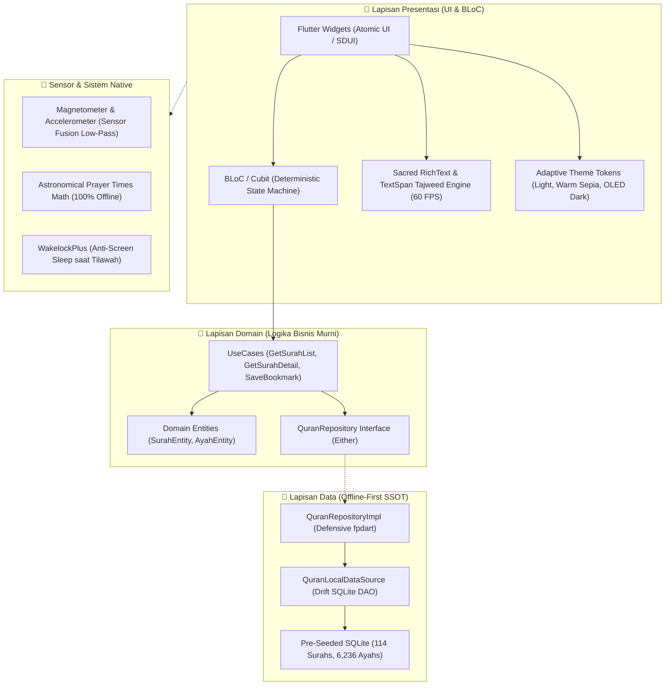
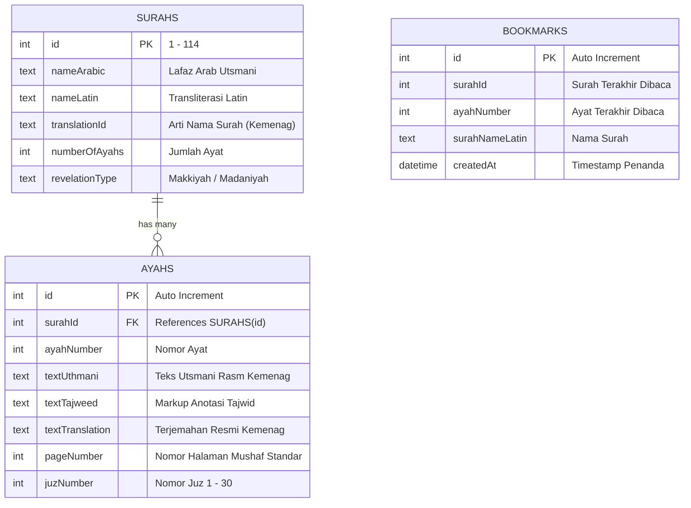

# 🏛️ QuranApp Architecture Deep-Dive & Clean Architecture Blueprint

> **Enterprise Standard:** Feature-First Clean Architecture, Reactive BLoC State Management, Drift SQLite Offline-First, and GPU-Accelerated Sacred Typography.

---

## 📐 1. Visual Arsitektur Sistem (The 3-Layer Boundary)

---

## 🛡️ 2. Aturan Batas Arsitektural (*Architectural Invariants*)

1. **Ketergantungan Satu Arah (*The Dependency Rule*):**
   - Lapisan Domain murni bebas dari ketergantungan Flutter framework atau library pihak ketiga (`flutter/material.dart`, SQLite, network).
   - Lapisan Presentasi dan Data bergantung ke Domain, bukan sebaliknya.
2. **Penanganan Kesalahan Fungsional (*Defensive fpdart*):**
   - Dilarang melempar *unhandled exception*. Seluruh repositori mengembalikan `Future<Either<Failure, T>>`.
3. **Kedaulatan Data Lokal (*Offline-First SSOT*):**
   - Drift SQLite adalah *Single Source of Truth*. Aplikasi tidak pernah menampilkan spinner kosong saat offline.
4. **Rendering GPU Murni Bebas WebView:**
   - Ayat Al-Qur'an dan anotasi tajwid dirender langsung via `RichText` & `TextSpan` native untuk menjaga stabilitas 60–120 FPS tanpa lag memori.

---

## 🗄️ 3. Skema Basis Data Drift SQLite

