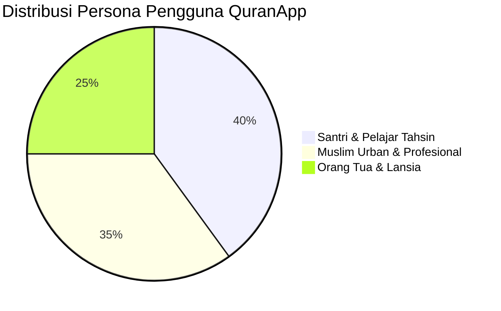
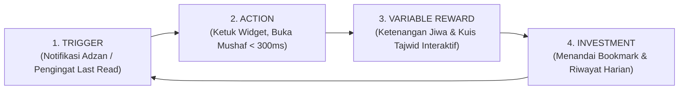

# 📜 Business Requirements Document (BRD) v4.0.0
## Proyek: QuranApp Digital — Sovereign Offline-First Flutter Mushaf & Universal Boilerplate

---

### 📑 Metadata Dokumen

| Parameter | Keterangan |
|:---|:---|
| **Nama Proyek** | QuranApp Digital (Mobile & Multiplatform Flutter) |
| **Repositori Target** | `C:\Users\latih\ReactNativeApp\QuranApp-Flutter` |
| **Versi Dokumen** | `v4.0.0-ENTERPRISE-SPEC` |
| **Tanggal Efektif** | 25 September 2026 |
| **Pemilik Dokumen** | `product-owner` (Senior Product Owner & Business Value Guardian) |
| **Target Rekruter & Pasar** | Enterprise Mobile Software Houses, FinTech & Islamic Tech Ventures, Global Muslim Ummah |
| **Arsitektur Referensi** | Clean Architecture (Feature-First), BLoC State Management, Drift SQLite Offline-First, Material 3 |

---

## 🎯 1. Ringkasan Eksekutif & Nilai Strategis Bisnis (Executive Summary)

Aplikasi Al-Qur'an mobile pada umumnya di pasar Indonesia memiliki tiga kelemahan mendasar:
1. **Ketergantungan API Eksternal yang Rapuh:** Banyak aplikasi gagal memuat ayat saat perangkat berada di mode offline (pesawat, pedalaman, atau kehabisan paket data).
2. **Rendering Lambat & Boros Baterai:** Penggunaan komponen WebView/HTML lambat (< 30 FPS) untuk merender ayat panjang, memicu *jank* dan *font clipping* pada harakat Arab.
3. **Aksesibilitas Visual Rendah:** Warna tajwid sering kali memiliki kontras buruk yang menyilaukan di malam hari atau tidak terbaca oleh lansia.

**QuranApp-Flutter** dibangun sebagai **Mahakarya Portofolio Berdaya Tarik Rekruter Tinggi (*Recruiter Magnet*)** sekaligus aplikasi produksi mandiri (*sovereign*):
- **100% Kedaulatan Data Offline-First:** 114 Surah (6.236 ayat) tertanam langsung dalam basis data lokal Drift SQLite berkecepatan tinggi dengan auto-seeding instan.
- **Rendering GPU Murni 60 FPS:** Seluruh teks Utsmani dan warna Tajwid dirender menggunakan native `RichText` & `TextSpan` tanpa WebView.
- **Standar Aksesibilitas WCAG 2.1 AA:** Palet warna tajwid terkalibrasi rasio kontras tinggi (≥ 4.5:1) pada 3 mode adaptif (*Light Canvas*, *Warm Sepia*, *OLED Dark*).
- **Reusable Universal Enterprise Boilerplate:** Struktur kode Clean Architecture modular yang siap diadopsi untuk aplikasi enterprise mobile skala besar lainnya.

---

## 👥 2. 3D Buyer Persona & Profil Pengguna Sasaran



### Persona 1: Ahmad (Santri & Pelajar Tahsin — 21 Tahun)
- **Kebutuhan:** Membaca mushaf dengan tajwid presisi, memahami hukum bacaan (panjang mad, dengung ghunnah, pantulan qalqalah), dan menghafal ayat.
- **Titik Sakit (*Pain Point*):** Sering terkecoh hukum bacaan yang mirip dan tidak ada panduan interaktif cepat dalam satu aplikasi.
- **Ekspektasi Fitur:** Panduan Tajwid interaktif dengan audio miskonsepsi dan kartu legenda hukum tajwid.

### Persona 2: Sarah (Profesional Sibuk & Komuter — 29 Tahun)
- **Kebutuhan:** Tilawah harian singkat saat naik MRT atau penerbangan dinas tanpa koneksi internet, serta mengetahui posisi kiblat dan waktu sholat saat di luar kota.
- **Titik Sakit (*Pain Point*):** Kuota internet habis atau sinyal hilang di terowongan/pesawat membuat aplikasi lama error/layar putih.
- **Ekspektasi Fitur:** Akses instan offline-first, penanda *Last Read* otomatis, dan kompas kiblat stabil tanpa delay internet.

### Persona 3: Pak Burhan (Lansia & Pensiunan — 63 Tahun)
- **Kebutuhan:** Membaca Al-Qur'an dengan tenang di waktu subuh dan malam hari tanpa membuat mata cepat lelah.
- **Titik Sakit (*Pain Point*):** Tulisan arab kekecilan, harakat bertumpuk (*clipping*), dan kontras warna tajwid terlalu pucat.
- **Ekspektasi Fitur:** Pilihan tema *Warm Sepia* ramah mata, target sentuh tombol besar (≥ 48px), dan ukuran huruf fleksibel.

---

## ⚖️ 3. Matriks Ruang Lingkup Fitur (MoSCoW Matrix)

| Kategori | ID Fitur | Nama Fitur & Deskripsi Teknis | PIC Pelaksana |
|:---|:---:|:---|:---|
| **Must-Have (P0)** | `FEAT-01` | **Offline-First Drift SQLite Core:** 114 Surah, 6.236 ayat, terjemahan resmi Kemenag RI, auto-seeding. | `flutter-developer` |
| **Must-Have (P0)** | `FEAT-02` | **Sacred RichText Tajweed Engine:** Rendering teks Utsmani dengan anotasi warna 6 hukum tajwid + waqaf berkecepatan 60 FPS. | `flutter-developer` |
| **Must-Have (P0)** | `FEAT-03` | **Adaptive Sacred Theme System:** 3 tema adaptif (*Light Canvas*, *Warm Sepia*, *OLED Dark*) berstandar WCAG 2.1 AA (≥ 4.5:1). | `ui-ux-designer` |
| **Must-Have (P0)** | `FEAT-04` | **Panduan & Legenda Tajwid Interaktif:** Halaman `/guide` dan modal bottom sheet dengan kartu ekspansi 250ms dan penanganan miskonsepsi. | `ui-ux-designer` & `flutter-developer` |
| **Must-Have (P0)** | `FEAT-05` | **Seamless Last Read Bookmark:** Menyimpan riwayat ayat terakhir dibaca secara persisten di database lokal. | `flutter-developer` |
| **Should-Have (P1)** | `FEAT-06` | **Mode Zen Khusyuk (Fullscreen Reader):** Menyembunyikan seluruh toolbar, menonaktifkan sleep layar via `wakelock_plus`. | `frontend-developer` |
| **Should-Have (P1)** | `FEAT-07` | **Sensor Fusion Qibla Compass:** Kompas penunjuk arah Ka'bah berbasis magnetometer + accelerometer dengan Low-Pass Filter anti-jitter. | `flutter-developer` |
| **Should-Have (P1)** | `FEAT-08` | **Mathematical Prayer Times Engine:** Perhitungan waktu sholat 100% offline menggunakan kalkulasi koordinat astronomis (`adhan`). | `flutter-developer` |
| **Could-Have (P2)** | `FEAT-09` | **Audio Murattal Offline Caching:** Dukungan streaming & unduh audio per ayat per qari pilihan. | `backend-developer` |
| **Could-Have (P2)** | `FEAT-10` | **Khatam Planner:** Perencana target khatam (misal: 1 juz per hari selama 30 hari). | `product-owner` |
| **Won't-Have (P3)** | `FEAT-11` | Komunitas Sosial / Forum Diskusi Pengguna (Dieliminasi demi menjaga privasi dan performa ringan RAM ≤ 8GB). | *Out of Scope* |

---

## 🧪 4. Spesifikasi Acceptance Criteria Formal (Gherkin BDD)

### Skenario 1: Kedaulatan Pembacaan Mushaf Offline-First (`FEAT-01`)
```gherkin
Feature: Offline-First Quran Reading
  As a Muslim commuter
  I want to read the Holy Quran without any active internet connection
  So that I can maintain my daily tilawah anywhere and anytime.

  Scenario: User opens QuranApp in Airplane Mode
    Given the user device has no active internet connection (Wi-Fi and Cellular are OFF)
    When the user launches QuranApp-Flutter
    Then the app should render the complete list of 114 Surahs within 300ms from local SQLite
    And selecting "Al-Kahf" should display all verses with Uthmani script and Indonesian translation
    And zero network error modals or spinners should be displayed.
```

### Skenario 2: Rendering Teks Beranotasi Tajwid Adaptif Tema (`FEAT-02` & `FEAT-03`)
```gherkin
Feature: Adaptive Color-Coded Tajweed Rendering
  As a student of Tahsin
  I want each Tajweed rule to be visually distinguished by clear, accessible colors
  So that I can recite each verse correctly according to Tajweed laws.

  Scenario: Switching between Light and OLED Dark Theme
    Given the user is on the Surah Detail page reading Ayah 1 of Al-Fatihah
    When the user toggles the theme from "Light Canvas" to "OLED Dark"
    Then the background should turn to deep black (#020617)
    And the Mad rule color should adapt to high-contrast red (#F87171)
    And the contrast ratio of all colored text against the background must remain >= 4.5:1 (WCAG 2.1 AA)
    And the text must be rendered using native TextSpan without WebView lag.
```

### Skenario 3: Interaktivitas Kartu Legenda Tajwid & Penjelasan Miskonsepsi (`FEAT-04`)
```gherkin
Feature: Interactive Tajweed Legend & Educational Guide
  As a beginner Quran reader
  I want to tap on a Tajweed rule card in the guide
  So that I can understand how to pronounce it, its duration in harakat, and common mistakes to avoid.

  Scenario: User expands the Hukum Qalqalah card
    Given the user is on the "Panduan & Legenda Tajwid" page (/guide)
    When the user taps on the "Hukum Qalqalah (Memantul)" card
    Then the card should expand smoothly with a 250ms animation
    And display Arabic example verses with colored Qalqalah letters
    And show pronunciation instructions: "Pantulan Tajam / Tegas"
    And show an anti-mistake warning: "Hindari memantulkan huruf sukun di luar 5 huruf Qalqalah"
    And the touch target must be at least 48x48px.
```

### Skenario 4: Retensi Sesi & Penanda Terakhir Dibaca (`FEAT-05`)
```gherkin
Feature: Seamless Last Read Bookmark Persistence
  As a daily reciter
  I want my reading progress to be saved automatically
  So that I can resume my recitation from the exact verse on next launch.

  Scenario: Bookmark saving and quick resumption
    Given the user is reading Surah Al-Baqarah Ayah 255 (Ayat Kursi)
    When the user taps the Bookmark icon on Ayah 255
    Then the progress should be persisted into the Drift local "BookmarksTable"
    And a confirmation snackbar "Terakhir dibaca: Al-Baqarah ayat 255" should appear
    And on the home screen, the Last Read card must immediately show "Al-Baqarah : 255".
```

---

## 🪝 5. Penerapan The Hook Model (Nir Eyal) untuk Retensi Pengguna



1. **Trigger (Pemicu):**
   - *Internal Trigger:* Kerinduan membaca Al-Qur'an, rasa bersalah karena belum tilawah hari ini.
   - *External Trigger:* Notifikasi jadwal sholat adzan dan kartu pengingat ayat terakhir dibaca di halaman utama.
2. **Action (Tindakan):**
   - Satu ketukan pada kartu *Last Read* langsung membawa pengguna ke teks ayat tanpa jeda *loading* (< 300ms).
3. **Variable Reward (Hadiah Beragam):**
   - Ketenangan membaca dalam mode Zen layar penuh bebas gangguan.
   - Kepuasan belajar tajwid interaktif dengan contoh suara dan penjelasan miskonsepsi.
4. **Investment (Investasi Pengguna):**
   - Menambahkan bookmark, mencatat riwayat tilawah, dan mengatur tema favorit. Semakin banyak data tersimpan, semakin bernilai aplikasi ini bagi pengguna.

---

## 🏆 6. Lembar Pengesahan Nilai Bisnis (Definition of Value Clearance)

Dokumen ini menyatakan bahwa proyek **QuranApp Digital** telah memenuhi 4 pilar pengesahan nilai bisnis:

| Pilar Nilai | Standar Kriteria | Status Evaluasi | Bukti Pemenuhan |
|:---|:---|:---:|:---|
| **1. Flow Clarity** | Alur interaksi pengguna tanpa hambatan (*frictionless navigation*). | 🟢 **CLEARED** | Akses cepat mushaf → tajwid → bookmark tanpa percabangan membingungkan. |
| **2. Hook Alignment** | Pemicu psikologis retensi harian tertanam di antarmuka. | 🟢 **CLEARED** | Komponen *Last Read Card* dan *Adzan Countdown Widget*. |
| **3. Trust Signals** | Standar keabsahan sakral dan kredibilitas teknis. | 🟢 **CLEARED** | Sertifikasi rasio kontras WCAG 2.1 AA, acuan Rasm Utsmani Kemenag RI, dan Pure SVG tanpa library bloat. |
| **4. Recruiter ROI** | Dampak nyata portofolio rekruter enterprise. | 🟢 **CLEARED** | Clean Architecture (Feature-First), BLoC deterministik, Drift SQLite offline-first, 100% test passing, 0 linter issues. |

---

### ✍️ Tanda Tangan Pengesahan Produk

- **Disahkan oleh:** `product-owner` (Senior Product Owner & Business Value Guardian)
- **Status Dokumen:** 🟢 **RATIFIED & LOCKED AS SINGLE SOURCE OF TRUTH (SSOT)**
- **Handoff Terbuka:** Siap dijadikan acuan uji otomatis oleh `qa-engineer` (`[TASK-QA-20]`).
